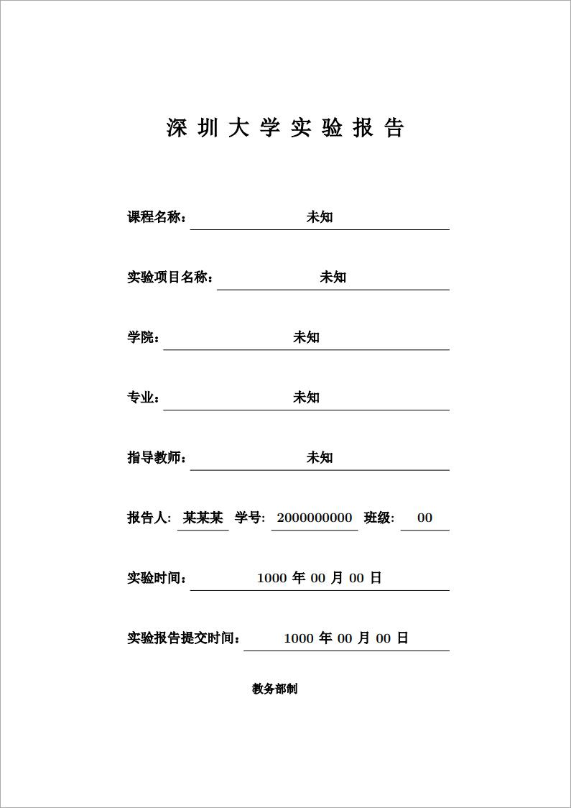
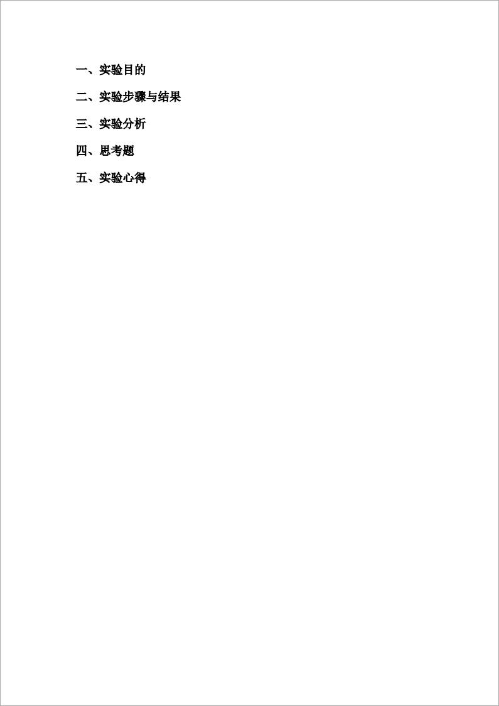

# 深圳大学实验报告LaTeX模板

## 简介
-------------
此模板为撰写深圳大学本科实验报告的LaTeX模板。

## 预览
-------------

## 文件说明
-------------
    ├──img/    预览图目录
    ├──refer/    参考目录
    |  └──shiyuanbg.doc    参考文件
    └──src/
       └──main.tex    LaTeX模板
       └──main.pdf    预览
       └──back_cover.pdf    封底pdf

## 说明
-------------
* 该实验报告参照**旧版**[深大本科教务处](https://jwb.szu.edu.cn/)提供的实验报告模板（/refer/shiyuanbg.doc）进行制作，尽力做到还原。
* 报告的封面部分和正文部分由LaTeX编译生成，而最后的教师评价部分**暂时**通过pdf文件直接拼接生成。
* 由于我是一个LaTeX新手，为了还原word文档的效果，使用了很多不美观的排版方式，代码也不够简洁，欢迎大佬指出与完善。
